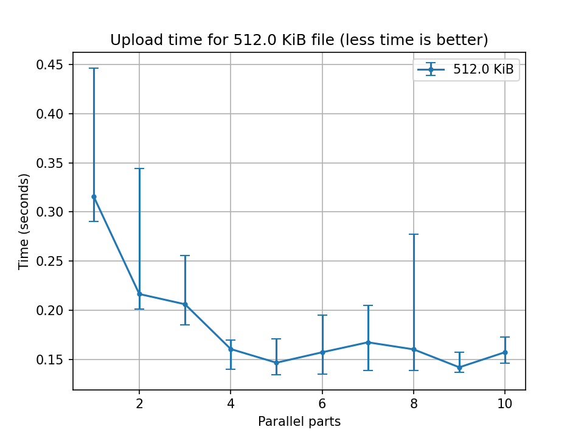
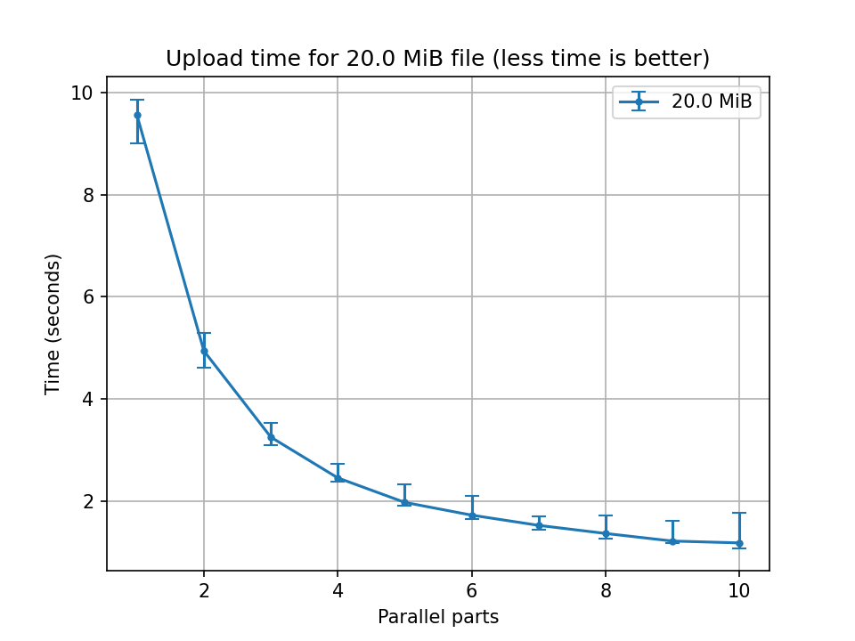
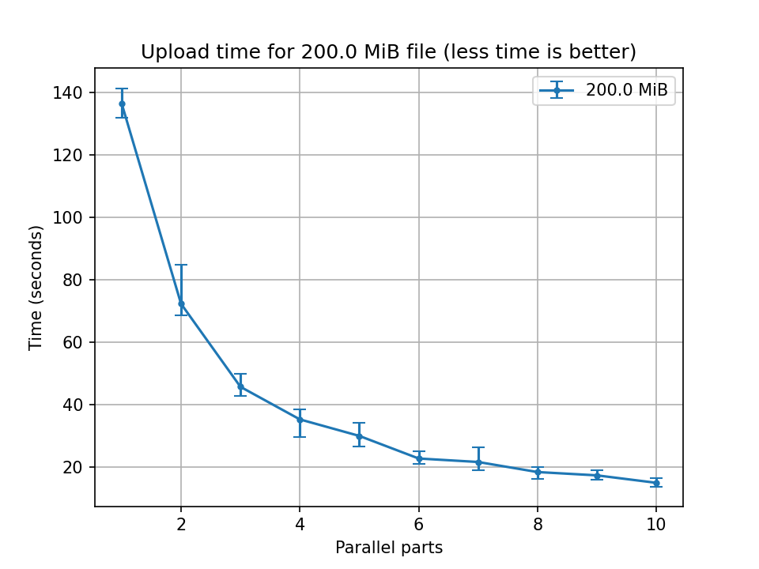
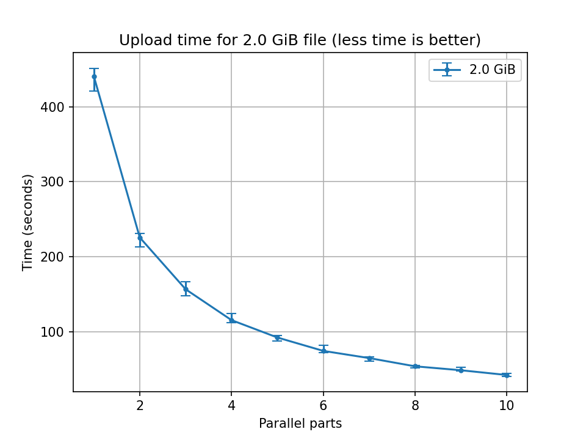

.. _upload_benchmark:

Upload benchmarks
=================
The following results are a study about the performance of Telegram-upload uploading files. The results are not
intended to be exhaustive and are subject to errors for multiple reasons. Some of them are:

* The Telegram status *(e.g. the server load)* at the time of the test.
* The network status at the time of the test *(the contracted bandwidth is 600 Mibps)*.
* The hardware used for the test *(in my case a PC with an Intel i7-3770K CPU @ 3.50GHz and 20 GiB of RAM)*.
* The machine load at the time of the test.

The tests were performed using different file sizes. The file sizes were 512 KiB, 20 MiB, 200 MiB and 2 GiB. The chunk
size was the default in Telegram-upload. The chunk size vary depending on the file size:

* *128 KiB* for files smaller than *100 MiB*.
* *256 KiB* for files smaller than *750 MiB*.
* *512 KiB* for files bigger than *750 MiB*.

The tests were performed using different number of parallel chunks uploaded at the same time. By default
Telegram-upload uploads *4 chunks at the same time*. You can change this value using the ``PARALLEL_UPLOAD_BLOCKS``
environment variable. For example::

    $ PARALLEL_UPLOAD_BLOCKS=2 telegram-upload video.mkv

Or exporting the variable::

    $ export PARALLEL_UPLOAD_BLOCKS=2
    $ telegram-upload video.mkv

Note that increasing the number of parallel chunks uploaded at the same time will increase the CPU usage and can
increase the number of 429 errors. These errors are caused by Telegram after exceeding the server's resource limits.

These tests can help you to choose the best number of parallel chunks uploaded at the same time for your use case. All
the tests were performed using 1, 2, 3, 4, 5, 6, 7, 8, 9 and 10 parallel chunks uploaded at the same time.

You can run the tests yourself using the ``upload_benchmark.py`` script in the ``docs`` directory. This script will
upload a file to Telegram using your account and will measure the time it takes to upload the file. To run the script::

    $ python3 ./upload_benchmark.py benchmark

This script will create a ``upload_benchmark.json`` file in the ``docs`` directory with the results. You can use the
``upload_benchmark.py`` script to plot the results using the ``graphs`` command::

    $ python3 ./upload_benchmark.py graphs

The above command will create the images in the same directory. For create the rst tables you can use the ``rst``
command::

    $ python3 ./upload_benchmark.py rst

The following results were obtained using the ``upload_benchmark.py`` script.

Small files (512 KiB)
---------------------
The following table shows the time it takes to upload a 512 KiB file using different number of parallel chunks.

.. include:: benchmark_512.0_KiB.rst

Each file is **uploaded 10 times** to obtain the minimum, maximum, the average and the median time. The data can be
visualized in the following graph:

Observing the results from 4 blocks in parallel there is no improvement in the upload time. This is because the file
size is 512 KiB and the chunk size is 128 KiB. This means that the file is uploaded in 4 chunks
*(512 KiB / 128 KiB = 4)*. The small ups and downs are due to external factors.

Medium files (20 MiB)
---------------------
The following table shows the time it takes to upload a 20 MiB file using different number of parallel chunks.

.. include:: benchmark_20.0_MiB.rst

Each file is **uploaded 10 times** to obtain the minimum, maximum, the average and the median time. The data can be
visualized in the following graph:

The speed boost decreases following a negative exponential curve. The improvement between 1 and 2 parts in parallel is
noticeable. Increasing the number of parts in parallel the improvement is less and less. With this file size the chunk
size is 128 KiB.

Big files (200 MiB)
-------------------
The following table shows the time it takes to upload a 200 MiB file using different number of parallel chunks.

.. include:: benchmark_200.0_MiB.rst

Each file is **uploaded 5 times** to obtain the minimum, maximum, the average and the median time. The data can be
visualized in the following graph:

The speed boost decreases following a negative exponential curve. The improvement between 1 and 2 parts in parallel is
noticeable. Increasing the number of parts in parallel the improvement is less and less. With this file size the chunk
size is 256 KiB.

Full size files (2 GiB)
-----------------------
The following table shows the time it takes to upload a 2 GiB file using different number of parallel chunks.

.. include:: benchmark_2.0_GiB.rst

Each file is **uploaded 5 times** to obtain the minimum, maximum, the average and the median time. The data can be
visualized in the following graph:

The speed boost decreases following a negative exponential curve. The improvement between 1 and 2 parts in parallel is
noticeable. Increasing the number of parts in parallel the improvement is less and less. With this file size the chunk
size is 512 KiB.

Complete results
----------------
The following table shows the time it takes to upload a 512 KiB, 20 MiB, 200 MiB and 2 GiB files using different number
of parallel chunks. Unlike the previous tables, all the data is included.

.. include:: benchmark_full.rst

The results are also available in the ``docs`` directory in the ``upload_benchmark.json`` file.
